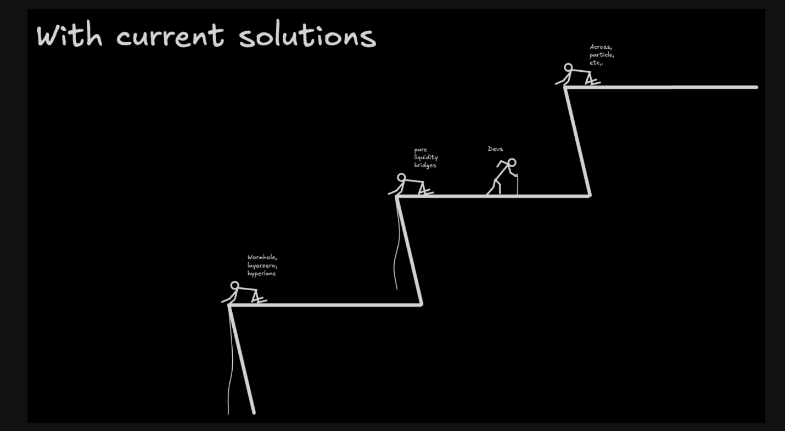
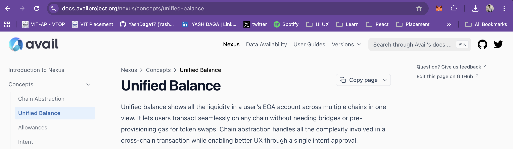
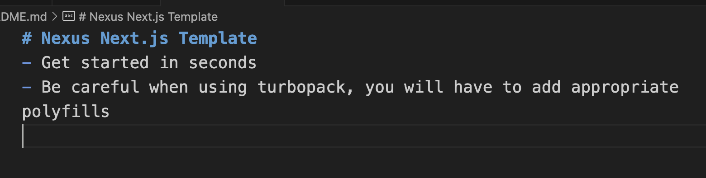
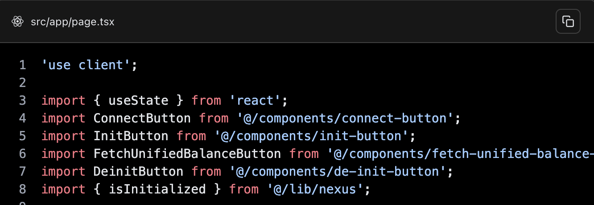
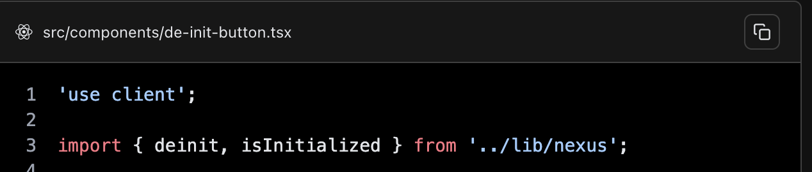
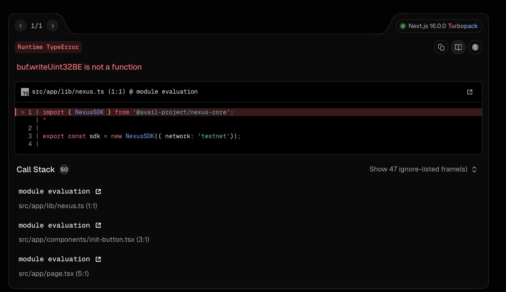
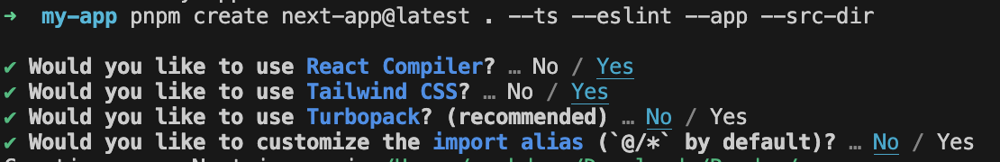

The text is difficult to read due to its small size. Adding engaging animations could improve developer interest. Please use clear terminology, such as "Externally Owned Account" instead of "EOA," and ensure consistent import paths. The Turbopack error in Next.js was resolved by following the solution shown below.

In the above image when I click on copy page I get the below response
Also I see EOA written but I would like Externally Owned Account to understand the term 

---
image: '/img/docs-link-preview.png'
---

Some places @/lib/nexus is working and in some places on the documents 
../lib/nexus is mentioned 

Here after setting up the whole things with the document I face this issues

So the above error which I got was due to turbopack usage on next.js 
which was mentioned on the readme.md file of the starter kit which was present over the github one

Below is the proper solution 

